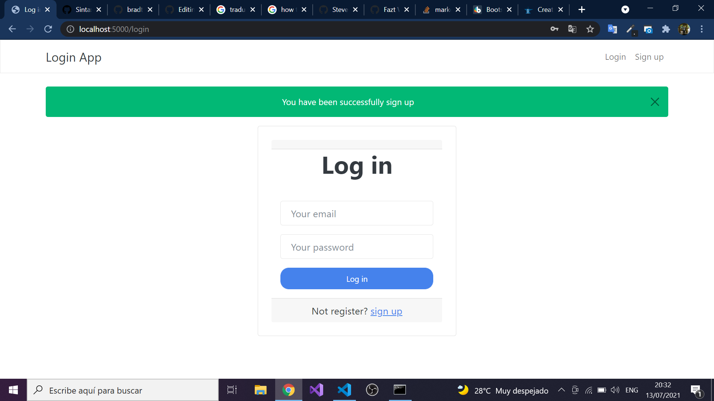

# Node.js Login without Passport

This is a practice(for me) user login app using Node.js, Express and MongoDB with EJS as template engine.
Bootstrap(Theme from  is used for styling.



### How to run

---
*NOTE*
Make sure of run mongoDB.
---

```sh
$ node install
```
The above command is for install all package or dependencies.

```sh
$ node start
```
The above command run the app(index.js)

```sh
$ node run dev
```
The above command run the app(index.js) with nodemon.

